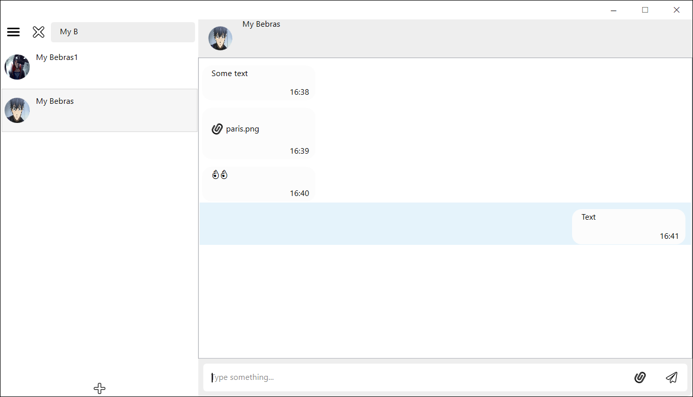

# NearMessage

## Introduction

The architecture of this system is based on a client-server model, utilizing ASP.NET Core API for the server-side and WPF .NET for the client-side. This structure leverages a multitude of technologies and features, resulting in a scalable and extensible solution. The layered design facilitates the development and enhancement of application logic, as well as the seamless addition of new features. On the client-side, a user-friendly interface is provided for an optimal user experience. Furthermore, the system offers the capability for API integration.

## Overview



## Technologies and Patterns were used in this project

* [Minimal API](https://learn.microsoft.com/en-us/aspnet/core/fundamentals/minimal-apis)
* [Entity Framework Core 7](https://docs.microsoft.com/en-us/ef/core/)
* [MediatR](https://github.com/jbogard/MediatR)
* [Carter](https://github.com/CarterCommunity/Carter)
* [Dependency injection](https://learn.microsoft.com/en-us/dotnet/core/extensions/dependency-injection)
* [Clean Architecture](https://github.com/jasontaylordev/CleanArchitecture)
* [CQRS](https://learn.microsoft.com/en-us/azure/architecture/patterns/cqrs)

## Requirement
These requirements must be met before you begin:
If your .Net version < 7, install it by following this link [.Net 7.0](https://dotnet.microsoft.com/en-us/download/dotnet/7.0)

## Getting Started
### Database
By default, the template is configured to use the database my server. 

If you want to use your Server, you need to update the WebUI/appsettings.json as follows:
```json
"ConnectionStrings": {
    "DefaultConnection": "Your server name"
  },
```
### Database Migrations
To use dotnet-ef for migrations, first make sure that your database is connecting to the application and there are no connection errors, then add the following flags to the command (the values assume that you are running the command from the storage root)

* `--project src/Infrastructure` (optional if in this folder)
* `--startup-project src/WebUI`
* `--output-dir Persistence/Migrations`

For example, to add a new migration from the root folder:

 `dotnet ef migrations add "TestMigration" --project src\Infrastructure --startup-project src\WebUI --output-dir Persistence\Migrations`

If necessary, you can migrate as done by default. In the Infastructure layer itself

Verify that the DefaultConnection connection string within appsettings.json points to a valid SQL Server instance.
When you run the application the database will be automatically created (if necessary) and the latest migrations will be applied.

### JwtOptions
The server implements a system using a JWT token. To configure it, you still need to go to the file WebUI/appsettings.json 
and find there JwtOptions and Authentication
JwtOptions:
```json
"JwtOptions": {
    "Issuer": "near-message",
    "Audience": "desktop",
    "SecurityKey": "BEFC9868EF8328534EFC562BRERE62592"
  },
```
Authentication:
```json
"Authentication": {
    "IncludeErrorDetails": false,
    "RequireHttpsMetadata": true,
    "SaveToken": true,
    "TokenValidationParameters": {
      "ValidateIssuer": true,
      "ValidateAudience": true,
      "ValidateLifetime": true,
      "ValidateIssuerSigningKey": true
    }
```
By default, it looks like this. But you can change this data and change the data in the token itself. 
You can do this in the Infrastructure/Authentication/JwtProvider.cs file
```cs
public string Generate(User user)
    {
        var claims = new Claim[]
        {
            new(JwtRegisteredClaimNames.Name, user.Username),
            new(JwtRegisteredClaimNames.Sub, user.Id.ToString())
        };

        var signingCredentials = new SigningCredentials(
            new SymmetricSecurityKey(
                Encoding.UTF8.GetBytes(_options.SecurityKey)),
            SecurityAlgorithms.HmacSha256);

        var token = new JwtSecurityToken(
            _options.Issuer,
            _options.Audience,
            claims,
            null,
            DateTime.UtcNow.AddDays(1),
            signingCredentials);

        var tokenValue = new JwtSecurityTokenHandler().WriteToken(token);

        return tokenValue;
    }
```

## Main functions of the messenger:
* Maintaining a local repository of messages, data about users on the client;
* Maintaining a database on the server, where all information will be stored;
* Maintenance of the storage on the server, where messages and user data will be stored;
* Maintaining a repository on the server, in which messages and user data will be stored;
* User authorization;
* User registration;
* User correspondence, using text messages and files;
* Searching for other users.

## Restrictions

Messenger can be extended with new features, logic, etc. But if you change the underlying features, you should expect that you have to change the interaction logic of the underlying business logic to implement the new one.

In addition, the speed of this messenger is not fast by choosing the wrong database. MS SQL Server is not the best choice for this.

## License
This project is licensed with the [MIT license](LICENSE.txt).
